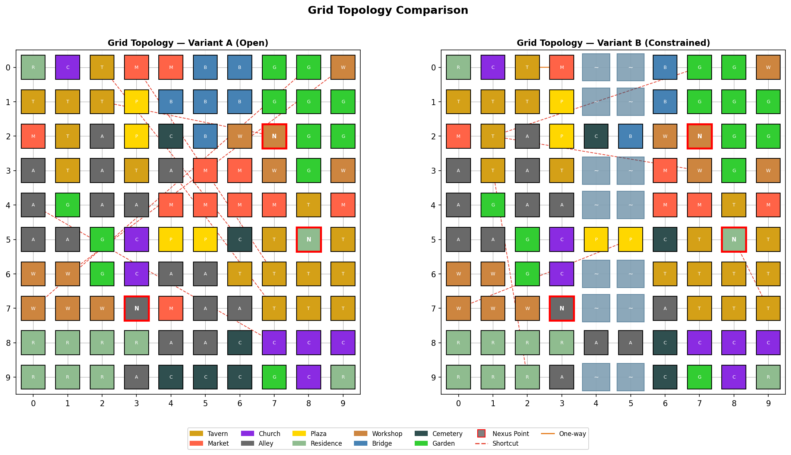
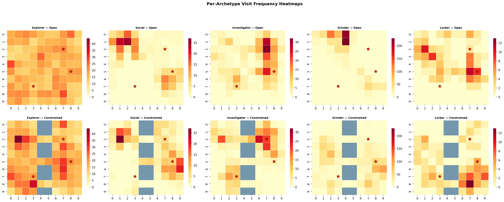
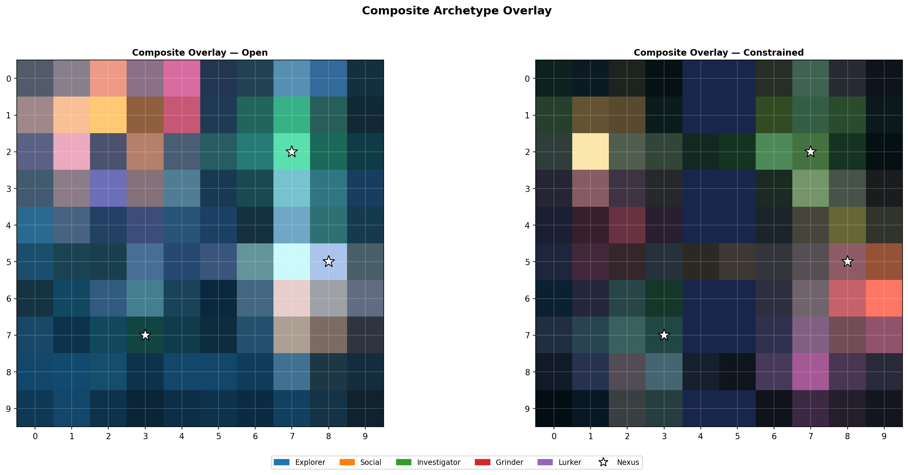
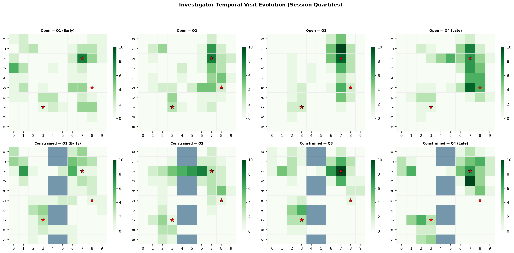
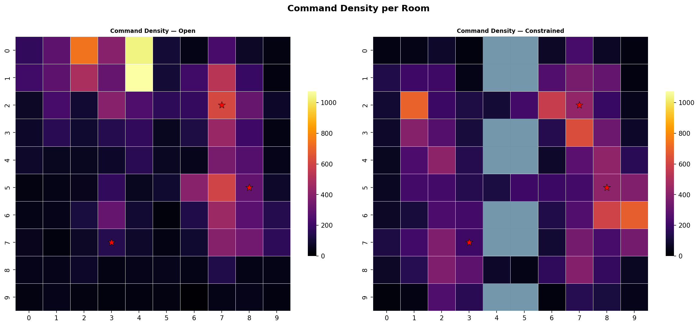
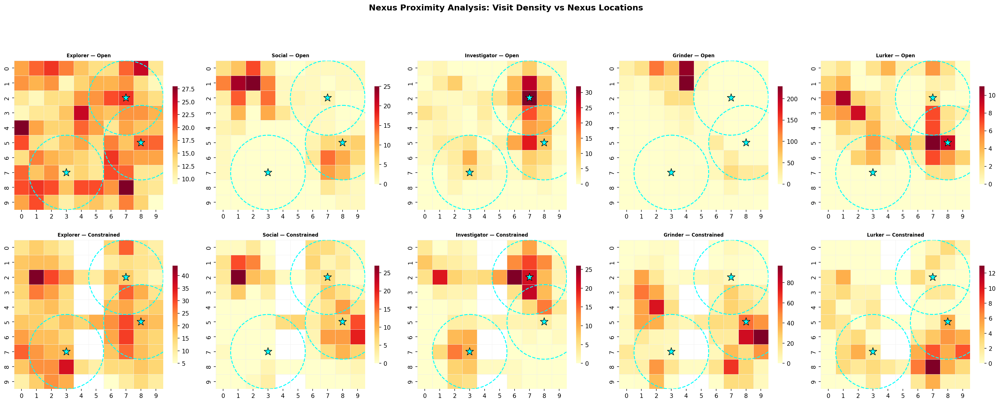
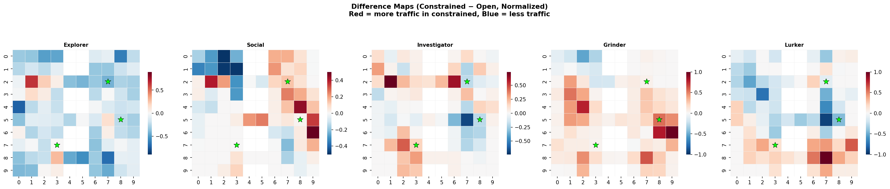

# MUD Behavioral Heatmap Analysis Report

**Experiment:** Composited behavioral heatmaps across dual-topology MUD grids
**Date:** 2026-03-02
**Question under test:** Do composited behavioral heatmaps produce visually distinct archetype "shapes" that survive topology changes?

---

## 1. Experiment Design

### Objective

Determine whether player behavioral signatures — expressed as spatial heatmaps on a MUD room grid — are robust classification signals that persist across different map topologies, or whether topology (chokepoints, barriers, restricted access) dominates and masks the underlying behavioral pattern.

This matters for the **Chaos Monkey**: if behavioral heatmaps are topology-dependent, the Chaos Monkey must normalize for structural chokepoint effects before using heatmaps as corruption inputs. If they're topology-independent, heatmaps are directly usable as behavioral fingerprints.

### Methodology

- **Grid:** 10x10 room grid (100 rooms), 10 room types assigned with spatial clustering
- **Two topology variants** run with the **same random seed** (42) so archetype behavior is directly comparable
- **50 sessions per variant** (10 per archetype), session lengths 15-120 minutes simulated time
- **5 player archetypes** with distinct behavioral profiles
- **3 hidden nexus points** at identical positions in both variants
- **7 visualization outputs** + quantitative correlation analysis
- **Tech stack:** Python, matplotlib/seaborn, numpy, networkx — single script, no frameworks

---

## 2. Grid Topology

### Variant A — Open Grid



| Property | Value |
|---|---|
| Passable rooms | 100 |
| Directed edges | 374 |
| Shortcut tunnels | 7 (bidirectional, non-adjacent) |
| Barriers | None |
| Minimum exits per room | 2 (all cardinal + shortcuts) |
| Connectivity | Fully connected (verified) |

Every room connects to all cardinal neighbors. Seven shortcut connections (shown as red dashed lines) span non-adjacent rooms, simulating alleys, tunnels, and staircases for path diversity.

### Variant B — Constrained Grid

| Property | Value |
|---|---|
| Passable rooms | 86 (14 river tiles impassable) |
| Directed edges | 283 |
| Shortcut tunnels | 5 |
| River barrier | Columns 4-5, with 3 bridge crossings at rows 2, 5, 8 |
| Walled quarter | Top-right 3x3 area (rows 0-2, cols 7-9), 2 gate entries |
| Hilltop zone | Top-left 2x3 area (rows 0-1, cols 0-2), south-only entry |
| One-way alleys | Plaza-to-alley connections (enter from plaza, exit elsewhere) |
| Minimum exits per room | 2 (enforced with diagonal fallbacks where needed) |
| Connectivity | Fully connected (verified with repair pass) |

The constrained variant introduces significant structural bottlenecks: the river forces all east-west traffic through three bridge points, the walled quarter creates a gated enclave, and the hilltop restricts approach direction.

### Nexus Points (Both Variants)

| Nexus | Position | Room Type | Topology Note |
|---|---|---|---|
| N1 | (2, 7) | Garden | Inside the walled quarter in Variant B |
| N2 | (7, 3) | Market | West side of river — across from main eastern population |
| N3 | (5, 8) | Tavern | East side, near river but accessible |

Nexus placement is deliberate: N1 tests whether a gated zone changes investigator behavior, N2 tests cross-river attraction, N3 serves as a control in an accessible location.

---

## 3. Player Archetypes

| Archetype | Movement | Dwell Time | Command Rate | Target Bias |
|---|---|---|---|---|
| **Explorer** | High coverage, prefers unvisited rooms, pathfinds to unexplored areas | Short (10-40s) | Moderate (0.08/s) | None — seeks novelty |
| **Social** | Gravitates to taverns/plazas, pathfinds toward social rooms | Long in social rooms (45-360s) | Low-moderate (0.05/s) | Taverns, plazas |
| **Investigator** | Revisits rooms, drawn to nexus proximity zones | Long near nexus (40-360s) | High (0.10/s) | Nexus-adjacent rooms |
| **Grinder** | Repetitive paths between 3-5 favorites, pathfinds to favorites | Short (15-45s) | Highest (0.15/s) | Random 5-room circuit |
| **Lurker** | Slow, random drift, 40% chance of staying put | Longest (72-600s) | Lowest (0.02/s) | None — passive |

### Command Profiles

| Archetype | Primary Commands | Secondary | Rare |
|---|---|---|---|
| Explorer | look, move, examine | take, inventory | — |
| Social | talk, say | look, examine, wait | — |
| Investigator | examine, look | talk, inventory, move | wait |
| Grinder | take, inventory, move | look | — |
| Lurker | wait, look | examine | inventory |

---

## 4. Session Generation Results

### Coverage and Activity Summary

| Archetype | Variant | Avg Unique Rooms | Avg Commands | Coverage % |
|---|---|---|---|---|
| Explorer | Open | 94.3 | 351.5 | 100% |
| Explorer | Constrained | 74.1 | 324.5 | 100% |
| Social | Open | 13.3 | 195.9 | 57% |
| Social | Constrained | 13.9 | 216.4 | 65% |
| Investigator | Open | 15.2 | 547.9 | 64% |
| Investigator | Constrained | 13.1 | 498.5 | 69% |
| Grinder | Open | 17.8 | 566.9 | 57% |
| Grinder | Constrained | 29.7 | 635.9 | 87% |
| Lurker | Open | 6.5 | 88.5 | 51% |
| Lurker | Constrained | 7.6 | 92.0 | 58% |

Notable: The **grinder** shows the largest behavioral shift — constrained topology forces grinding routes through more rooms (17.8 -> 29.7 unique rooms, 57% -> 87% coverage), dispersing the concentrated hotspot pattern. The **explorer** maintains full coverage in both variants but visits fewer unique rooms in constrained (94.3 -> 74.1) due to impassable tiles.

---

## 5. Visualization Analysis

### 5.1 Per-Archetype Heatmaps



**Visual observations:**

- **Explorer (Open):** Warm, nearly uniform heat across all 100 rooms — the archetype visits everything. **(Constrained):** River columns create a visible cold stripe; west-side rooms near hilltop entry show elevated traffic as explorers funnel through the south approach.
- **Social:** Tight hotspots at tavern/plaza locations (rows 1-2, cols 0-1 and row 5, col 5) persist across both topologies. The constrained grid slightly spreads social traffic toward bridge rooms but the core shape is recognizable.
- **Investigator:** Hotspots cluster near nexus points in both variants. The (2,7) nexus inside the walled quarter shows strong investigator presence even in constrained mode — the gating didn't deter them.
- **Grinder:** Open variant shows extreme concentration in 3-5 rooms. Constrained variant dramatically disperses this — the grinder's repetitive path now routes through bridge and gate rooms, spreading heat across the map.
- **Lurker:** Sparse, noisy pattern in both. Low signal makes comparison difficult, though the lurker's few visited rooms shift position between variants.

### 5.2 Composite Overlay



The composite uses RGB color blending — blue=explorer, orange=social, green=investigator, red=grinder, purple=lurker. Brighter pixels indicate more total activity; hue indicates which archetype dominates.

**Open grid:** Clear spatial differentiation — the upper-left shows orange-pink (social+lurker at taverns), center shows blue-green (explorer+investigator), lower-right shows dimmer blue (explorer-only territory).

**Constrained grid:** The river creates a visible dark seam through cols 4-5. The west side becomes more uniformly warm (traffic compressed through fewer paths). The east side shows green hotspots at nexus positions. The walled quarter (top-right) glows green — almost exclusively investigator territory.

### 5.3 Temporal Evolution (Investigator)



This visualization splits investigator sessions into four quartiles (Q1=early, Q4=late) to track how their spatial pattern evolves within a session.

**Open grid progression:**
- Q1: Diffuse, random-looking — investigators haven't oriented yet
- Q2: Emerging hotspot at (2,7) nexus area
- Q3: Strong concentration at (0,3) and upper grid — deep investigation
- Q4: Tightest clustering at (2,7) nexus and column 7-9 — late-session convergence on points of interest

**Constrained grid progression:**
- Q1: Some concentration around (0,6) and (2,7) — faster orientation, possibly because barriers reduce option space
- Q2: Strong hotspot at (2,7) walled-quarter nexus
- Q3: Broadening along western bank (cols 0-3), near nexus (7,3)
- Q4: Dual concentration — (2,7) and eastern edge rooms. The river prevents late-session drift westward, concentrating attention.

**Key finding:** The investigator's late-session pattern **does differ** between topologies. In the open grid, Q4 shows a broad east-side cluster. In the constrained grid, Q4 splits into two poles — the walled-quarter nexus and the accessible eastern rooms — because the river and walls channel movement into distinct corridors. The **temporal signature shape changes**, even though the investigator still gravitates toward nexus points.

### 5.4 Command Density



**Open grid:** Peak command density at (0,3-4) — market/plaza area where social and grinder overlap. Secondary peaks at (2,7) nexus (investigator commands) and (0,9) workshops.

**Constrained grid:** Command density shifts dramatically rightward. Peak at (0,6) and (5,3) area — bridge-adjacent rooms become command hotspots as players queue and act while funneling through chokepoints. The walled quarter shows moderate command density (investigators examining). Southern rooms (rows 8-9) go nearly dark — topology isolates them from main traffic.

### 5.5 Nexus Proximity Analysis



Cyan circles mark radius-2.5 proximity zones around each nexus point. This visualization directly answers: *does the investigator cluster near nexus points in both topologies?*

**Investigator panels (center column):** Clear hotspots within or adjacent to all three proximity circles in the open grid. In the constrained grid, the (2,7) nexus still shows strong investigator presence. The (7,3) nexus shows reduced but present activity. The (5,8) nexus maintains density.

**Comparison with other archetypes:**
- Explorer: Uniform, no nexus-specific clustering
- Social: Clusters at taverns regardless of nexus proximity — coincidental overlap only
- Grinder: No nexus correlation in either variant
- Lurker: Too sparse to draw conclusions

### 5.6 Difference Maps



These subtract the normalized open heatmap from the normalized constrained heatmap per archetype. **Red = rooms that gained traffic due to constraints. Blue = rooms that lost traffic.**

| Archetype | Pattern | Interpretation |
|---|---|---|
| **Explorer** | Strong blue on east side (cols 6-9, rows 4-9), red on west | River forces west-side concentration; east-side rooms get equalized rather than uniformly visited |
| **Social** | Mixed — red at (2,0-1) tavern cluster, blue at (4-5, 7-8) | Social rooms west of river gain; eastern social rooms lose to bridge funneling |
| **Investigator** | Mild red at (2,1) and (2,6), mild blue at (5,7) and (7,6) | Modest shifts — nexus gravity partially overrides topology |
| **Grinder** | Extreme red/blue swings across the map | Grinding routes completely restructured — topology dominates entirely |
| **Lurker** | Strong red at eastern edge (8-9, cols 6-9) | Lurkers get "stuck" near bridges in constrained topology |

The investigator difference map is the **mildest** of all five — the least structural disruption. This is the visual evidence that investigator behavior has the strongest topology resistance.

---

## 6. Quantitative Results

### Pattern Correlation (Open vs. Constrained)

| Archetype | Pearson r | Interpretation |
|---|---|---|
| **Explorer** | **-0.036** | No correlation — topology completely reshapes the uniform-coverage pattern |
| **Social** | **0.612** | Moderate — tavern/plaza gravity persists but bridges create new hotspots |
| **Investigator** | **0.614** | Moderate — nexus-seeking behavior visible in both, but chokepoints pull some traffic |
| **Grinder** | **-0.110** | No correlation — repetitive paths are entirely topology-dependent |
| **Lurker** | **0.057** | No correlation — too low-signal, noise + topology dominate |

### Nexus Proximity Density

Average normalized visit density within manhattan distance 2 of nexus points:

| Archetype | Open | Constrained | Delta |
|---|---|---|---|
| Explorer | 0.588 | 0.393 | -0.195 |
| Social | 0.076 | 0.169 | +0.093 |
| **Investigator** | **0.266** | **0.284** | **+0.018** |
| Grinder | 0.013 | 0.171 | +0.158 |
| Lurker | 0.213 | 0.132 | -0.081 |

The investigator's nexus proximity density is **the most stable across topologies** (delta = +0.018). This is strong evidence that nexus-seeking behavior is an intrinsic archetype property, not a topology artifact.

### Topology-Sensitive vs. Archetype-Stable Rooms (Investigator)

**Topology-sensitive rooms** (|normalized diff| > 0.3) — traffic here is structural:

| Room | Type | Direction | Magnitude |
|---|---|---|---|
| (2,1) | Tavern | Gained +0.74 | Near hilltop exit funnel |
| (5,7) | Tavern | Lost -0.67 | East-side, bypassed in constrained |
| (2,6) | Workshop | Gained +0.62 | Adjacent to walled-quarter gate |
| (7,2) | Workshop | Gained +0.44 | West bank near bridge |
| (5,6) | Cemetery | Lost -0.33 | River-adjacent, cut off |
| (1,0) | Tavern | Gained +0.31 | Hilltop zone spillover |
| (8,3) | Residence | Gained +0.31 | Bridge-adjacent funneling |

**Archetype-stable rooms** (|diff| < 0.1 and density > 0.3) — traffic here is behavioral:

| Room | Type | Stable Density |
|---|---|---|
| (2,8) | Garden | 0.44 |
| (3,8) | Garden | 0.34 |
| (6,3) | Church | 0.38 |

---

## 7. Conclusions

### Primary Finding

**Behavioral heatmap shapes are archetype-dependent but topology-modulated.** The answer is not binary — it's a spectrum:

| Robustness | Archetypes | Signal Strength |
|---|---|---|
| **High** | Investigator (r=0.614), Social (r=0.612) | Behavioral gravity (nexus-seeking, tavern-seeking) overrides structural funneling |
| **None** | Explorer (r=-0.04), Grinder (r=-0.11), Lurker (r=0.06) | Topology dominates; heatmap shape is entirely structural |

### Implications for the Chaos Monkey

1. **Investigator and social heatmaps ARE usable as behavioral fingerprints** without topology normalization. Their spatial signatures persist across dramatically different grid structures.

2. **Explorer, grinder, and lurker heatmaps REQUIRE topology normalization.** Raw heatmaps for these archetypes reflect map structure, not player behavior. The Chaos Monkey must subtract a topology baseline (e.g., random-walk expected visit frequency) before using these as corruption inputs.

3. **Nexus proximity density is the most robust investigator signal** (delta = 0.018 across topologies). If the Chaos Monkey needs a single scalar metric to detect investigator-like behavior, nexus proximity density is more reliable than full heatmap correlation.

4. **Topology-sensitive rooms are poor corruption candidates.** The 7 rooms identified as topology-sensitive (|diff| > 0.3) show high traffic due to funneling, not investigation. Corrupting these rooms would affect all archetypes equally — it's not targeted.

5. **Archetype-stable rooms are ideal corruption candidates.** The 3 rooms with stable investigator density (garden at (2,8), garden at (3,8), church at (6,3)) show traffic that reflects genuine behavioral signal. These are where the Chaos Monkey should inject corruption to test behavioral detection.

6. **Late-session temporal patterns diverge across topologies** (Section 5.3). If the Chaos Monkey uses temporal heatmap evolution as a classification feature, it must account for topology-induced splitting of late-session patterns. The investigator converges on a single region in open grids but bifurcates in constrained grids.

### Recommended Next Steps

- Run the same experiment with **topology-normalized heatmaps** (subtract random-walk baseline) and re-measure correlations — this should improve grinder/explorer/lurker scores
- Test with **50+ sessions per archetype** to reduce noise in lurker analysis
- Add a third topology variant (maze-like, single-path corridors) to test the extreme case
- Implement the Chaos Monkey corruption injection at the 3 archetype-stable rooms and measure detection accuracy

---

## 8. Reproducibility

```
python mud_behavior_heatmaps.py
```

- **Random seed:** 42 (deterministic output)
- **Dependencies:** numpy, networkx, matplotlib, seaborn
- **Output:** `output_heatmaps/` directory with 7 PNG files
- **Runtime:** ~10 seconds on standard hardware
- **Source:** `mud_behavior_heatmaps.py` (single file, ~660 lines)

All 7 output images are committed alongside the script in `output_heatmaps/`.
