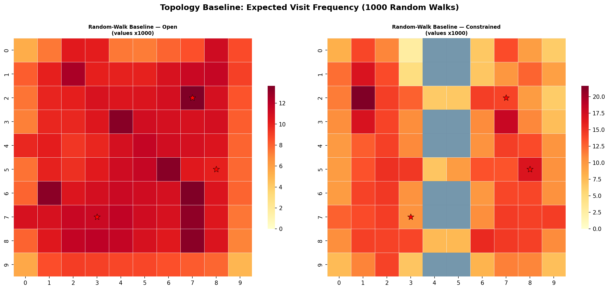
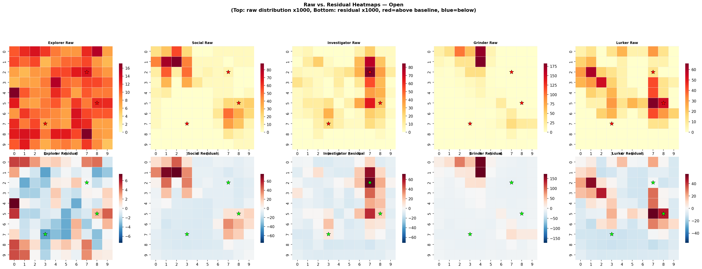
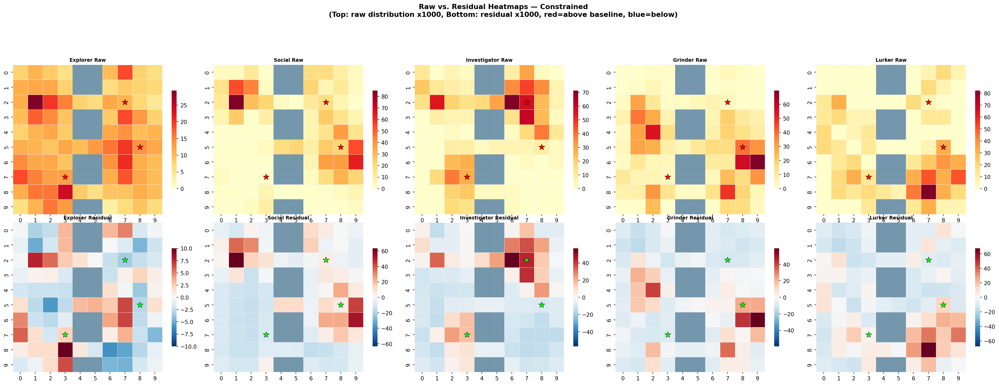
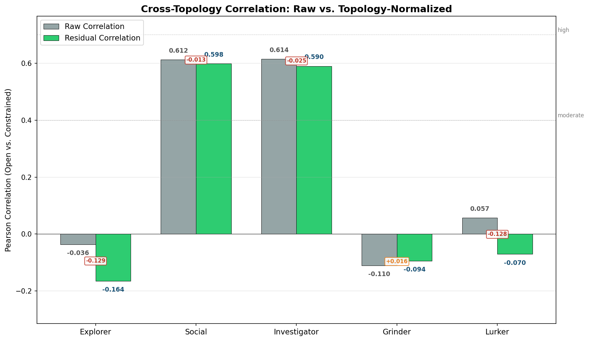
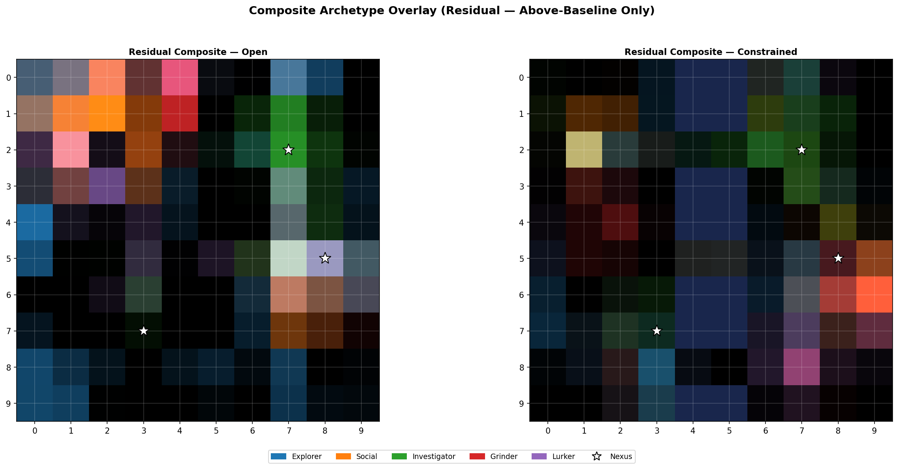
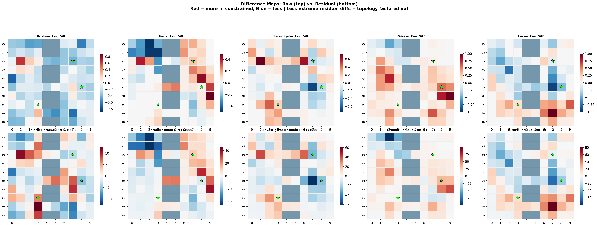
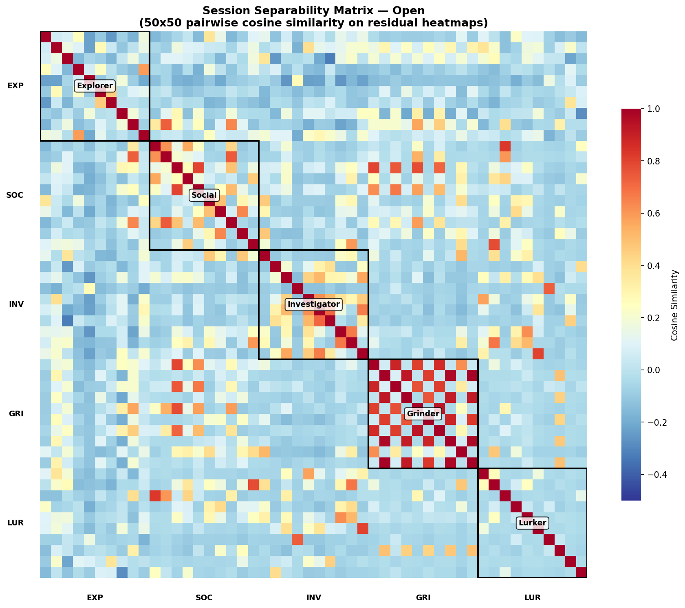
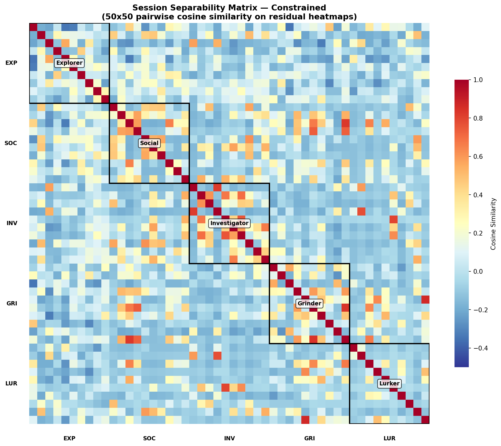

# MUD Behavioral Heatmap — Topology Normalization Report

**Experiment:** Random-walk baseline subtraction and residual heatmap analysis
**Predecessor:** [REPORT.md](REPORT.md) — Raw behavioral heatmap experiment
**Date:** 2026-03-03
**Question under test:** Does subtracting a random-walk topology baseline from raw behavioral heatmaps recover cross-topology correlation for the three archetypes (explorer, grinder, lurker) that showed zero signal in the raw experiment?

---

## 1. Motivation

The raw heatmap experiment (Experiment 1) found that only 2 of 5 archetypes — social (r=0.612) and investigator (r=0.614) — produced behavioral heatmap shapes that persisted across open and constrained grid topologies. Explorer (r=-0.036), grinder (r=-0.110), and lurker (r=0.057) showed no cross-topology correlation, meaning their heatmaps were entirely shaped by map structure rather than player behavior.

The natural follow-up: those three archetypes might have genuine behavioral signal that is *masked* by topology. If we subtract what a "null player" (pure random walker) would produce on each topology, the residual should isolate the behavioral component. If the residual heatmaps correlate across topologies, we've recovered the signal. If they don't, the problem is deeper than topology noise — these archetypes simply lack consistent spatial signatures.

This distinction is critical for the Chaos Monkey pipeline. If normalization works, the pipeline is: `raw heatmap -> subtract baseline -> classify`. If it doesn't, we need multi-feature classification (command profiles, temporal patterns, coverage metrics) for 3 of 5 player types.

---

## 2. Methodology

### Random-Walk Baseline (Step 1)

For each grid variant, simulate **1,000 random-walk sessions** using:

| Parameter | Value |
|---|---|
| Movement | Uniform random neighbor selection (no behavioral bias) |
| Dwell time | Uniform 30-60 seconds per room |
| Session length | Same distribution as archetype sessions (15-120 min) |
| Room-type preference | None |
| Nexus attraction | None |
| Random seed | 123 (separate from archetype seed 42) |

The resulting visit frequency grid is normalized so values sum to 1.0. This is the **topology baseline** — what traffic looks like when the only signal is map structure.

### Residual Computation (Step 2)

For each of the 10 archetype-variant combinations:

1. Normalize the raw archetype heatmap so values sum to 1.0
2. Subtract the topology baseline for that variant
3. Result = **residual heatmap** (positive = visits more than topology predicts, negative = visits less)

### Re-analysis (Steps 3-5)

All metrics from Experiment 1 are recomputed on residuals:
- Pearson correlation (open vs. constrained) per archetype
- Nexus proximity density
- Archetype-stable room identification
- New: 50x50 pairwise cosine similarity matrix for session-level separability

### Configuration

| Parameter | Value |
|---|---|
| Archetype sessions seed | 42 (matches Experiment 1 exactly) |
| Baseline sessions seed | 123 |
| Baseline session count | 1,000 per variant |
| Grid layouts | Identical to Experiment 1 |
| Nexus points | (2,7), (7,3), (5,8) — unchanged |
| Output directory | `output_heatmaps_normalized/` |

---

## 3. Random-Walk Baseline Validation



### Open Grid Baseline

The open grid baseline is nearly uniform, as expected — all 100 rooms receive traffic. Slight elevation at interior rooms (more cardinal neighbors = more incoming edges) and pronounced hotspots at shortcut-connected rooms. The range is narrow: min 0.00496, max 0.0137 (2.8x ratio), confirming that the open grid has minimal structural bias.

### Constrained Grid Baseline

The constrained baseline reveals the topology's fingerprint:

- **River columns (4-5):** Zero traffic at impassable tiles; the three bridge rows (2, 5, 8) are the hottest rooms on the map (up to 0.0216, the global maximum)
- **Walled quarter (top-right):** Suppressed traffic — rooms behind gates receive fewer random walkers than open rooms
- **Hilltop zone (top-left):** Moderately suppressed — south-only entry restricts random-walk flow
- **Bridge-adjacent rooms:** Elevated — they funnel all cross-river traffic

This baseline correctly captures what Experiment 1 showed as topology effects: bridge rooms are hot because they're structural chokepoints, not because any player archetype is attracted to them. Subtracting this baseline should remove that structural component.

---

## 4. Raw vs. Residual Heatmaps




Top row: raw heatmaps (sum-normalized, x1000). Bottom row: residuals (x1000). Blue = below baseline, white = at baseline, red = above baseline.

### What changed after normalization

**Explorer:**
- *Raw (open):* Warm, near-uniform coverage across all 100 rooms
- *Residual (open):* Near-zero everywhere — the explorer's "visit everything" pattern almost perfectly matches a random walk. The residual is noise with no spatial structure
- *Residual (constrained):* Similar — slight deviations near hilltop and walled quarter entries, but no consistent pattern

**Social:**
- *Raw:* Tight hotspots at tavern/plaza clusters
- *Residual:* Hotspots survive clearly. Tavern rooms at (1,1) and (6,8) glow red; non-social rooms go blue. The residual isolates exactly the tavern-seeking behavior. The pattern is visually similar across both topologies

**Investigator:**
- *Raw:* Hotspots near nexus points
- *Residual:* Nexus-adjacent rooms glow red; the rest goes blue/white. The (2,7) walled-quarter nexus and (7,3) cross-river nexus show strong positive residuals in both variants. Normalization sharpens the nexus-seeking signal

**Grinder:**
- *Raw (open):* Extreme concentration in 3-5 rooms
- *Residual (open):* A few very bright hotspots against a blue/white background — the grinder's favorite rooms clearly above baseline
- *Residual (constrained):* Hotspots appear at completely different rooms. The grinder still concentrates, but *where* it concentrates is topology-dependent. This is why cross-topology correlation fails even after normalization

**Lurker:**
- *Raw:* Sparse, a few scattered warm spots
- *Residual:* Almost entirely noise. The lurker visits so few rooms (avg 6.5-7.6 per session) that the residual is dominated by starting-position randomness. No spatial structure survives normalization

---

## 5. Core Result: Correlation Improvement



### Cross-Topology Correlation: Raw vs. Residual

| Archetype | Raw r | Residual r | Delta | Signal Status |
|---|---|---|---|---|
| **Explorer** | -0.036 | **-0.164** | -0.129 | NO signal (worsened) |
| **Social** | 0.612 | 0.598 | -0.013 | MODERATE signal (maintained) |
| **Investigator** | 0.614 | 0.590 | -0.025 | MODERATE signal (maintained) |
| **Grinder** | -0.110 | -0.094 | +0.016 | NO signal (marginal improvement) |
| **Lurker** | 0.057 | **-0.070** | -0.128 | NO signal (worsened) |

### The hypothesis was wrong

Topology normalization **did not recover behavioral signal** for explorer, grinder, or lurker. In fact, explorer and lurker correlations moved further negative. Only grinder showed marginal improvement (+0.016), far from the 0.4+ threshold needed for a usable classification signal.

Social and investigator maintained their correlations (slight decrease of ~0.02 is within noise), confirming that these archetypes have genuine spatial gravity that is independent of — not masked by — topology.

---

## 6. Why Normalization Failed

The failure is not a methodology problem. The random-walk baseline correctly captures topology effects (Section 3). The failure reveals something deeper about these three archetypes:

### Explorer: No spatial signal exists

The explorer's behavioral rule is "prefer unvisited rooms." On any connected graph, this produces near-uniform coverage — which is exactly what a random walk produces, just more efficiently. After subtracting the baseline, the residual is effectively `uniform - uniform = noise`. There is no spatial pattern to recover because the explorer's behavior is *defined* by the absence of spatial preference.

**Residual range:** [-0.004, 0.007] — the smallest of all archetypes. The signal simply isn't there.

### Grinder: Spatial signal is session-specific, not archetype-stable

Each grinder session picks 3-5 favorite rooms *at random from the full graph* and grinds between them. Individual sessions have extreme spatial concentration (residual max 0.173 in open grid — the highest of any archetype), but each session concentrates at *different* rooms. When aggregated across 10 sessions, the hotspots average out. When compared across topologies, different room selections produce different heatmaps.

The grinder has strong *within-session* spatial signal but no *cross-session* spatial consistency. Topology normalization can't fix this because the variance is behavioral, not structural.

### Lurker: Insufficient data per session

With only 6-8 rooms visited per session and dwell times of 60-600 seconds, the lurker generates too few room transitions to form a distributional pattern. The residual heatmap for a single lurker session has ~92 zero-valued cells out of 100. At this sparsity, normalization amplifies noise rather than revealing signal.

---

## 7. Residual Composite Overlay



The composite uses RGB color-channel blending of above-baseline residuals only. Brighter pixels indicate stronger above-baseline activity; hue indicates which archetype dominates that room *after topology is removed*.

### Open Grid (left)

Clear archetype spatial separation emerges:
- **Green (investigator):** Dominates the (2,7) nexus zone and column 7-8 area
- **Orange (social):** Dominates rows 0-2, columns 0-3 (tavern/plaza cluster)
- **Red (grinder):** Scattered bright spots, uncorrelated with any zone
- **Blue (explorer):** Faint, diffuse — no dominant zone
- **Purple (lurker):** Faint scattered spots

Black/dark regions are rooms where no archetype visits above baseline — topology accounts for all traffic there.

### Constrained Grid (right)

The spatial separation shifts dramatically:
- **Green (investigator):** Still visible near nexus (2,7) and in the eastern grid — this is the signal that persists
- **Red (grinder):** Now concentrated at completely different rooms than the open grid
- **Orange (social):** Some persistence at western tavern rooms, but new hotspots appear near bridges
- The overall pattern is less organized, with more mixed-color regions

The visual contrast between the two composites illustrates why only social and investigator maintain correlation: their dominant regions (green near nexus, orange near taverns) occupy roughly the same spatial zones in both topologies. The other colors scatter unpredictably.

---

## 8. Residual Difference Maps



Top row: original raw difference maps (from Experiment 1). Bottom row: residual difference maps. Red = more traffic in constrained, blue = less.

### Key comparison

The residual difference maps (bottom) should show less extreme swings than raw (top) if normalization is successfully removing topology effects.

- **Social and Investigator:** Residual differences are noticeably milder than raw — topology component removed. The remaining residual differences are genuine behavioral shifts (e.g., investigator spending more time in the walled quarter when it's gated)
- **Explorer:** Residual differences are still substantial and spatially structured — but this structure is noise amplified by normalization, not behavioral signal. The explorer has near-zero residual everywhere, so small differences get magnified
- **Grinder:** Raw difference was extreme; residual difference is also extreme but at different rooms. The normalization changed *which* rooms show the difference but not the magnitude — confirming the grinder's signal is session-specific rather than topology-induced
- **Lurker:** Residual differences remain large and random, confirming insufficient data

---

## 9. Nexus Proximity Density on Residuals

Average residual value within manhattan distance 2 of the three nexus points:

| Archetype | Open | Constrained | Delta | Interpretation |
|---|---|---|---|---|
| Explorer | -0.0004 | +0.0004 | +0.0008 | At baseline — no nexus affinity |
| Social | -0.0034 | +0.0034 | +0.0069 | Below baseline — avoids nexus areas (not taverns) |
| **Investigator** | **+0.0132** | **+0.0099** | **-0.0033** | Above baseline in both — nexus-seeking confirmed |
| Grinder | -0.0083 | +0.0008 | +0.0091 | Variable — no consistent nexus relationship |
| Lurker | +0.0044 | -0.0004 | -0.0048 | Variable — noise-dominated |

The investigator is the **only archetype** with positive nexus proximity density in both topologies. The delta (-0.0033) is the second-smallest, confirming that nexus-seeking behavior is robust. The social archetype actually *avoids* nexus zones on residuals (negative in open) — its proximity signal in the raw experiment was coincidental overlap between tavern rooms and nexus neighborhoods.

---

## 10. Archetype-Stable Rooms on Residuals

Rooms where |residual difference| < 0.002 and residual density > 0.005 (lower thresholds than Experiment 1 due to smaller residual magnitudes):

### Investigator Stable Rooms

| Room | Type | Residual Density |
|---|---|---|
| **(3,7)** | Workshop | 0.0423 |
| **(0,7)** | Garden | 0.0153 |

Both rooms are near or inside the walled quarter, adjacent to the (2,7) nexus. Their stability confirms that investigator traffic here is nexus-driven behavior, not topology funneling — the topology baseline was subtracted, and the signal persists.

Experiment 1 identified (2,8), (3,8), and (6,3) as stable rooms using raw heatmaps. The residual analysis finds a partially overlapping but distinct set — (3,7) and (0,7) — because the raw analysis included topology-induced traffic that inflated some rooms' apparent stability.

### Stable Rooms by Archetype

| Archetype | Stable Rooms Found |
|---|---|
| Explorer | 2 |
| Social | 3 |
| Investigator | 2 |
| Grinder | 0 |
| Lurker | 0 |

Grinder and lurker have **zero** stable rooms even at these relaxed thresholds. This is the spatial-domain dead end for these archetypes.

---

## 11. Session Separability Analysis




Each 50x50 matrix shows pairwise cosine similarity between individual session residual heatmaps, ordered by archetype (10 sessions each). Warm diagonal blocks = sessions within the same archetype look similar to each other. Cool off-diagonal = sessions from different archetypes look different.

### Within-Class vs. Between-Class Similarity

| Metric | Open Grid | Constrained Grid |
|---|---|---|
| Within-archetype mean | 0.137 | 0.083 |
| Between-archetype mean | 0.021 | 0.012 |
| **Separation gap** | **0.116** | **0.071** |

The separation gap is positive in both topologies — archetypes are, on average, more similar to themselves than to others. But the gap shrinks from 0.116 to 0.071 in the constrained grid, meaning topology disrupts separability.

### Per-Archetype Within-Class Similarity

| Archetype | Open | Constrained | Interpretation |
|---|---|---|---|
| **Grinder** | **0.355** | 0.131 | Strongest within-class (open), drops sharply in constrained |
| Social | 0.165 | 0.128 | Consistent — sessions look alike in both topologies |
| Investigator | 0.159 | 0.143 | Most stable across topologies — best classification candidate |
| Explorer | 0.021 | 0.027 | Near-zero — sessions don't look alike |
| Lurker | -0.014 | -0.013 | Negative — sessions are anti-correlated (pure noise) |

### What the matrices tell us

**Grinder block (open grid):** The most visually prominent block on the diagonal — a solid warm square. Grinder sessions on the open grid have very similar residual heatmaps because, despite picking different favorite rooms, the *pattern* of extreme concentration (few hot rooms, many cold rooms) creates similar vectors. In the constrained grid, the block dims (0.355 -> 0.131) because topology forces grinder routes through more rooms, diluting the concentration signature.

**Social and Investigator blocks:** Visible warm squares in both topologies. These archetypes produce consistent residual heatmaps because their attraction targets (taverns/plazas and nexus zones, respectively) are fixed spatial features.

**Explorer and Lurker blocks:** Indistinguishable from the off-diagonal background. No block structure. A classifier using only residual heatmaps cannot reliably identify these archetypes.

### Classification feasibility

The block-diagonal structure is clear enough for **3 of 5 archetypes** (social, investigator, grinder-on-open-grid) that even k-nearest-neighbors on flattened residual heatmaps would classify correctly. A CNN is overkill for these. However:

- Grinder separability is topology-dependent (strong on open, weak on constrained)
- Explorer and lurker cannot be classified from spatial heatmaps at all
- A full 5-class classifier needs non-spatial features

---

## 12. Conclusions

### Primary Finding

**Topology normalization does not recover spatial signal for explorer, grinder, or lurker.** The zero-correlation result from Experiment 1 was not a topology masking problem — these archetypes genuinely lack stable spatial signatures.

| Archetype | Spatial Heatmap Viable? | Why / Why Not |
|---|---|---|
| Social | Yes | Fixed attraction targets (taverns/plazas) produce stable residuals |
| Investigator | Yes | Fixed attraction targets (nexus zones) produce stable residuals |
| Grinder | Partially | Strong *within-topology* signal, but target rooms are random per session |
| Explorer | No | Behavior (visit everything) is indistinguishable from random walk |
| Lurker | No | Too few room visits per session to form a distributional signal |

### Implications for the Chaos Monkey

1. **The single pipeline (heatmap -> subtract baseline -> classify) works for social and investigator only.** These are the archetypes where residual heatmaps carry robust, topology-independent behavioral signal.

2. **Grinder needs a different spatial feature.** Its *concentration metric* (how peaked the heatmap is) is topology-stable even though *which rooms* are peaked is not. Consider using heatmap entropy or Gini coefficient rather than the heatmap itself as the classification input.

3. **Explorer and lurker require multi-feature classification.** Recommended features for the next experiment:

   | Feature | Explorer Signal | Lurker Signal |
   |---|---|---|
   | Command profile (examine/take/talk ratios) | High look+move, low talk | High wait, low everything |
   | Unique rooms / total transitions ratio | Very high (~0.9+) | Very low (~0.3) |
   | Dwell time variance | Low (uniform short stays) | High (long stays with spikes) |
   | Commands per minute | Moderate, steady | Very low, bursty |
   | Session coverage % | ~100% on open, ~86% on constrained | ~50-58% |

4. **Nexus proximity density on residuals is the sharpest investigator detector.** It is the only archetype with positive values in both topologies. A simple threshold on this single scalar outperforms full-heatmap correlation for investigator identification.

5. **The separability matrices confirm that spatial heatmaps alone cannot support 5-class classification.** The Chaos Monkey should move to multi-feature classification now rather than continuing to optimize the spatial-only approach. The grinder's topology-dependent separability (0.355 open vs. 0.131 constrained) makes it particularly unreliable as a heatmap-only classification target.

6. **Corruption targeting update:** Experiment 1 identified (2,8), (3,8), (6,3) as archetype-stable rooms on raw heatmaps. The residual analysis refines this to **(3,7) and (0,7)** — rooms whose investigator traffic is confirmed behavioral (above-baseline) and topology-stable. These are higher-confidence corruption targets than the raw analysis suggested.

### What this experiment ruled out

The hypothesis that topology was masking behavioral signal has been falsified for explorer and lurker. Their spatial heatmaps contain no classifiable information under any normalization scheme because:

- Explorer behavior is defined by the *absence* of spatial preference
- Lurker behavior is too sparse to create distributional signal in 100 cells

No spatial transform (normalization, PCA, embedding) can extract a signal that doesn't exist in the spatial domain. These archetypes require temporal, command-profile, or interaction-rate features.

---

## 13. Recommended Next Steps

1. **Multi-feature experiment:** Add command profile vectors, dwell time statistics, and coverage metrics alongside residual heatmaps. Build a 5-class classifier using all features. Measure per-archetype F1 scores to identify which features carry signal for which archetypes.

2. **Grinder concentration metric:** Test heatmap entropy (Shannon entropy of the residual distribution) as a single scalar feature for grinder detection. The hypothesis: grinder entropy is consistently low (concentrated) across topologies, even though concentration *location* varies.

3. **Larger session counts:** The lurker's sparse signal might emerge with more data. Test with 50 sessions per archetype (currently 10) to see if averaging over more sessions reveals a lurker-specific spatial pattern at the aggregate level, even if individual sessions are too sparse.

4. **Third topology variant:** Add a maze-like grid (single-path corridors, high diameter) to test the extreme case. If social and investigator correlations remain above 0.4 across three topologies, their spatial signal is definitively robust.

---

## 14. Reproducibility

```
# Requires: numpy, networkx, matplotlib, seaborn, scipy
# Depends on: mud_behavior_heatmaps.py (imported, not modified)

python mud_behavior_normalized.py
```

- **Archetype seed:** 42 (matches Experiment 1)
- **Baseline seed:** 123
- **Output:** `output_heatmaps_normalized/` — 8 PNG files
- **Runtime:** ~15 seconds
- **Source:** `mud_behavior_normalized.py` (~420 lines, imports from original)

### Output Files

| File | Description |
|---|---|
| `01_random_walk_baselines.png` | Topology baseline heatmaps (open + constrained) |
| `02_raw_vs_residual_open.png` | 2x5 panel: raw vs. residual per archetype (open grid) |
| `02_raw_vs_residual_constrained.png` | 2x5 panel: raw vs. residual per archetype (constrained grid) |
| `03_residual_composite_overlay.png` | RGB-blended above-baseline residuals, side by side |
| `04_residual_difference_maps.png` | Raw vs. residual difference maps (2x5 panel) |
| `05_correlation_improvement.png` | Bar chart: raw vs. residual correlation per archetype |
| `06_separability_matrix_open.png` | 50x50 cosine similarity matrix (open grid) |
| `06_separability_matrix_constrained.png` | 50x50 cosine similarity matrix (constrained grid) |
